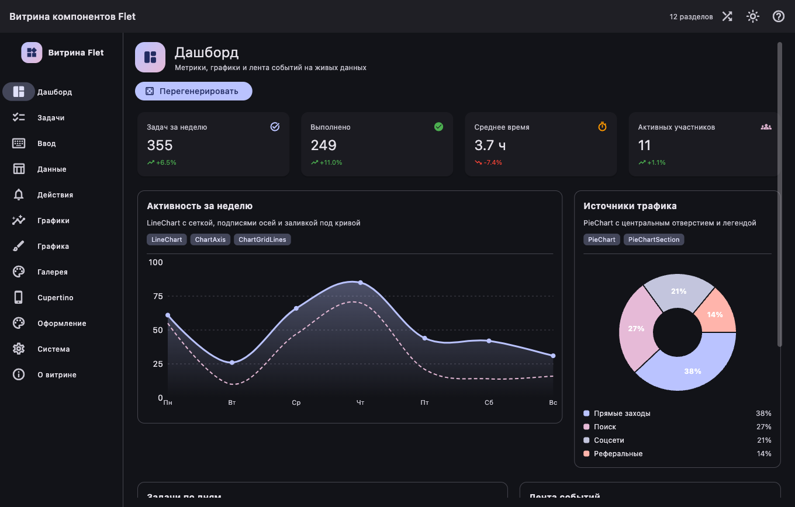
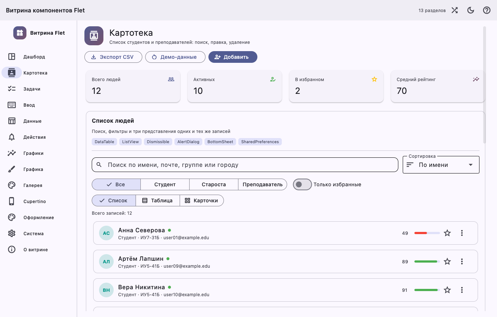
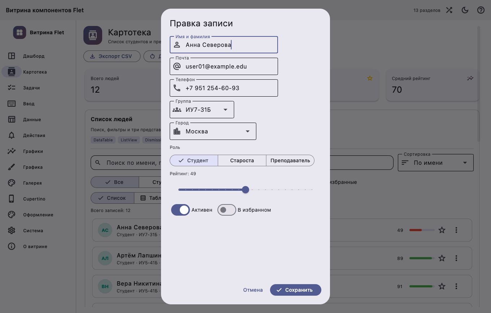
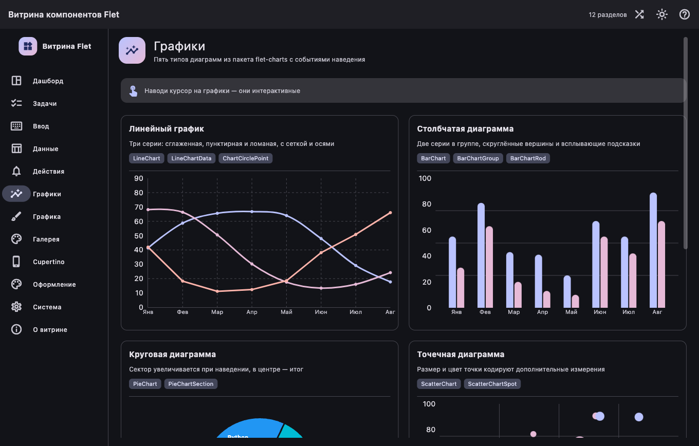
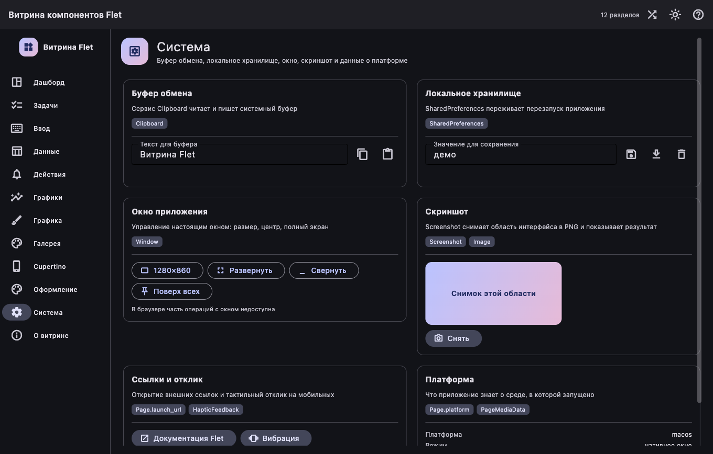

# Витрина компонентов Flet

Интерактивная демонстрация возможностей [Flet](https://flet.dev) на одном приложении: 13 разделов, больше 90 контролов Material и Cupertino, пять типов графиков, картотека людей с полным CRUD, рисование на Canvas, анимации и живая смена темы. Запускается нативным окном и собирается в настоящее GUI-приложение.



## Быстрый старт

```bash
make install   # зависимости через uv
make run       # нативное окно (GUI)
make run-web   # то же самое в браузере
```

## Что нужно установить

Чтобы запустить приложение из исходников, хватает четырёх системных инструментов:

| Инструмент | Версия | Зачем |
|------------|--------|-------|
| Python | 3.10+ (разработка идёт на 3.14, зафиксирован в `.python-version`) | сам код |
| [uv](https://docs.astral.sh/uv/) | 0.12+ | окружение и зависимости, ставит нужный Python сам |
| GNU Make | любая | точки входа проекта (`make run`, `make test`, …) |
| git | любая | получить репозиторий |

Всё остальное — Python-пакеты, они приезжают по `make install` (`uv sync --all-groups`) с точными версиями из `pyproject.toml` и `uv.lock`:

| Группа | Пакеты |
|--------|--------|
| runtime | `flet==0.86.5`, `flet-charts==0.86.5` |
| dev | `flet-cli==0.86.5`, `flet-desktop==0.86.5`, `flet-web==0.86.5` |
| test | `pytest==9.1.1`, `pytest-cov==7.1.0` |
| lint | `ruff==0.16.6`, `mypy==2.3.1` |

`flet-desktop` тянет с собой готовый Flutter-клиент — отдельно ставить Flutter для `make run` не нужно. Он понадобится только для сборки GUI, см. ниже.

## Что внутри

| Раздел | Что показывает | Ключевые контролы |
|--------|----------------|-------------------|
| Дашборд | метрики, три графика, лента событий, перегенерация данных | `Card`, `ResponsiveRow`, `LineChart`, `BarChart`, `PieChart`, `ListTile` |
| Картотека | список студентов и преподавателей: поиск, фильтры, три представления, создание, правка, удаление с отменой, экспорт CSV | `DataTable`, `ListView`, `Dismissible`, `AlertDialog`, `BottomSheet`, `SharedPreferences`, `PieChart` |
| Задачи | классический TodoMVC с приоритетами, фильтрами и прогрессом | `Checkbox`, `TextField`, `TabBar`, `PopupMenuButton`, `ProgressBar` |
| Ввод | текстовые поля, переключатели, ползунки, поиск, выбор даты и файлов | `TextField`, `Dropdown`, `Slider`, `RangeSlider`, `SegmentedButton`, `Chip`, `SearchBar`, `AutoComplete`, `DatePicker`, `TimePicker`, `FilePicker` |
| Данные | таблица с сортировкой и выделением, drag-and-drop, свайпы, сетка | `DataTable`, `ReorderableListView`, `Dismissible`, `GridView`, `ExpansionTile`, `ExpansionPanelList` |
| Действия | все виды кнопок, диалоги, уведомления, меню, подсказки | `FilledButton`, `AlertDialog`, `BottomSheet`, `NavigationDrawer`, `SnackBar`, `Banner`, `MenuBar`, `Tooltip`, `Badge` |
| Графики | пять типов диаграмм с событиями наведения | `LineChart`, `BarChart`, `PieChart`, `ScatterChart`, `RadarChart` |
| Графика | рисование мышью, фигуры, анимации, перетаскивание, слои | `Canvas`, `GestureDetector`, `Draggable`, `DragTarget`, `AnimatedSwitcher`, `Shimmer`, `ShaderMask`, `InteractiveViewer`, `Stack` |
| Галерея | 8825 иконок и 352 цвета с поиском, типографика | `Icons`, `Colors`, `GridView`, `TextSpan`, `SelectionArea` |
| Cupertino | те же сценарии в оформлении iOS | `CupertinoButton`, `CupertinoSwitch`, `CupertinoPicker`, `CupertinoAlertDialog`, `CupertinoActionSheet`, `CupertinoListTile` |
| Оформление | режим темы, seed-цвет, шрифт, палитра ColorScheme, Markdown | `Theme`, `ColorScheme`, `Markdown` |
| Система | буфер обмена, локальное хранилище, окно, скриншот, платформа | `Clipboard`, `SharedPreferences`, `Screenshot`, `Window`, `HapticFeedback` |
| О витрине | что внутри и как запускать | `Markdown`, `Card` |

Картотека — единственный раздел с настоящей моделью данных: одна и та же запись живёт в списке, таблице и карточках, правится через диалог с валидацией, удаляется свайпом или из меню (с кнопкой «Вернуть» в SnackBar) и переживает перезапуск приложения благодаря `SharedPreferences`.

Тема (светлая/тёмная и seed-цвет) применяется мгновенно ко всем разделам сразу. Горячие клавиши: `Ctrl/Cmd + 1…0` — переход к разделу, `Ctrl/Cmd + D` — переключение темы.

## Как это выглядит

| Картотека | Форма записи |
|-----------|--------------|
|  |  |

| Графики | Системные возможности |
|---------|----------------------|
|  |  |

## Структура

```
main.py              точка входа: страница, окно, горячие клавиши
app/shell.py         каркас: NavigationRail, AppBar, переключение разделов
app/theme.py         контроллер темы (режим, seed-цвет, шрифт)
app/ui.py            общие блоки: заголовки страниц, секции, плитки метрик
app/pages/*.py       по одному модулю на раздел
app/people/          картотека: модель, хранилище, формы и представления
tests/               pytest: логика, обработчики событий и сборка разделов
scripts/             установка готовой сборки из релиза
.github/workflows/   сборка под все платформы и публикация релиза
```

Раздел добавляется одной строкой в `SECTIONS` внутри `app/shell.py` — фабрика возвращает любой контрол.

## Сборка GUI

```bash
make build-macos    # .app для macOS
make build-linux    # приложение для Linux
make build-windows  # приложение для Windows
make build-web      # статическая web-версия
make build-matrix   # какие платформы доступны с текущей машины
```

Первая сборка скачивает Flutter SDK в `~/flutter` (около 3.8 ГБ) — это происходит один раз, дальше сборки быстрые. Заложи ещё несколько гигабайт под артефакты в `build/`.

Коротко, что и где получается:

| Команда | Где собирать | Результат |
|---------|--------------|-----------|
| `make build-macos` | macOS | `build/macos/flet-showcase.app` |
| `make build-linux` | Linux | `build/linux/`: бинарник `flet-showcase`, рядом `lib/` и `data/` |
| `make build-windows` | Windows | `build/windows/`: `flet-showcase.exe`, рядом DLL и `data/` |
| `make build-web` | где угодно | `build/web/`: статические файлы для любого веб-сервера |

На Linux и Windows приложение — это вся папка целиком: один бинарник без соседних `lib/`, DLL и `data/` не запустится, так что копируй и архивируй каталог полностью. Другой каталог для результата задаётся флагом `flet build <платформа> -o <путь>`.

Обе сборки проверены на macOS 26.6 (Apple Silicon):

- `make build-web` → `build/web`: самодостаточное приложение на Pyodide, работает без Python-сервера (достаточно `python3 -m http.server` из этой папки);
- `make build-macos` → `build/macos/flet-showcase.app`: нативное приложение (~306 МБ), запускается двойным кликом.

### Системные зависимости для сборки

Каждая платформа собирается только на себе: `.app` — на macOS, `.exe` — на Windows, бинарник Linux — на Linux. Web собирается везде и ничего дополнительного не требует.

**macOS** (проверено на этой машине):

```bash
sudo softwareupdate --install-rosetta --agree-to-license  # Apple Silicon
# Xcode 15+ ставится из App Store, затем
sudo xcode-select --switch /Applications/Xcode.app/Contents/Developer
sudo xcodebuild -runFirstLaunch
brew install cocoapods                                    # 1.16+
```

Нужен именно полный Xcode, а не Command Line Tools. Без CocoaPods сборка падает с `CocoaPods not installed or not in valid state` — флаг `--swift-package-manager` эту зависимость не снимает, потому что шаблон Flet всё ещё содержит `Podfile`.

**Linux** (Debian/Ubuntu) — GTK, GStreamer и toolchain для компиляции нативных плагинов:

```bash
sudo apt update
sudo apt install -y \
  binutils clang cmake gstreamer1.0-alsa gstreamer1.0-gl gstreamer1.0-gtk3 \
  gstreamer1.0-libav gstreamer1.0-plugins-bad gstreamer1.0-plugins-base \
  gstreamer1.0-plugins-good gstreamer1.0-plugins-ugly \
  gstreamer1.0-pulseaudio gstreamer1.0-qt5 gstreamer1.0-tools \
  gstreamer1.0-x libasound2-dev libgstreamer-plugins-bad1.0-dev \
  libgstreamer-plugins-base1.0-dev libgstreamer1.0-dev libgtk-3-dev \
  libmpv-dev libsecret-1-0 libsecret-1-dev libunwind-dev lld llvm mpv \
  ninja-build pkg-config
```

Актуальный список всегда знает сам Flet, так что скрипт установки можно не поддерживать руками:

```bash
sudo apt install -y $(uv run flet --version --json | jq -r '.linux_dependencies | join(" ")')
```

**Windows** — Visual Studio 2022 или 2026 с рабочей нагрузкой «Desktop development with C++». Ещё нужен режим разработчика (`start ms-settings:developers`), иначе сборка с плагинами упадёт на symlink'ах.

## Релизы и загрузка

Готовые сборки собирает workflow `Release` в GitHub Actions, каждую платформу на своём раннере:

| Файл в релизе | Для чего | Раннер |
|---------------|----------|--------|
| `flet-showcase-linux-x64.tar.gz` | Linux x86-64 | `ubuntu-22.04` |
| `flet-showcase-linux-arm64.tar.gz` | Linux ARM64 | `ubuntu-22.04-arm` |
| `flet-showcase-windows-x64.zip` | Windows x64 и Windows 11 на ARM через эмуляцию | `windows-2025` |
| `flet-showcase-macos-arm64.zip` | Mac на Apple Silicon | `macos-15` |
| `flet-showcase-macos-x64.zip` | Mac на Intel | `macos-15-intel` |

Рядом лежит `SHA256SUMS.txt` с контрольными суммами. Linux собирается на Ubuntu 22.04, поэтому бинарник работает на системах с glibc 2.35 и новее: Ubuntu 22.04+, Debian 12+. Отдельной сборки под Windows ARM64 нет: flet 0.86.5 забирает результат Flutter только из x64-каталога.

Выпустить релиз — значит поставить тег. Версия в теге должна совпадать с `version` в `pyproject.toml`, иначе workflow остановится на первом шаге:

```bash
git tag v2.1.0
git push origin v2.1.0
```

Тег запускает проверки (`make check`), сборку всех пяти платформ и публикацию. Если релиз для тега уже создан, например с changelog, файлы просто добавятся к нему.

Вручную workflow запускается из вкладки Actions или через `gh`. Без `tag` получится пробная сборка текущей ветки: архивы лежат в artifacts прогона 14 дней. С `tag` и `publish=true` выбранные платформы собираются из тега и заменяют свои файлы в релизе, так что упавшую платформу можно пересобрать отдельно:

```bash
gh workflow run release.yml                                   # пробная сборка всех платформ
gh workflow run release.yml -f targets=linux-arm64,macos-x64  # только выбранные
gh workflow run release.yml -f tag=v2.1.0 -f targets=windows-x64 -f publish=true
```

Установить последнюю версию под текущую систему можно одной командой. Скрипт сам выберет нужный файл, сверит контрольную сумму и распакует приложение: на macOS в `~/Applications`, на Linux в `~/.local/opt/flet-showcase` с командой `~/.local/bin/flet-showcase`, на Windows в `%LOCALAPPDATA%\Programs\flet-showcase`.

```bash
# macOS и Linux
curl -fsSL https://raw.githubusercontent.com/jtprogru/flet-showcase/main/scripts/install.sh | sh
curl -fsSL https://raw.githubusercontent.com/jtprogru/flet-showcase/main/scripts/install.sh | sh -s -- v2.1.0
```

```powershell
# Windows
irm https://raw.githubusercontent.com/jtprogru/flet-showcase/main/scripts/install.ps1 | iex
& ([scriptblock]::Create((irm https://raw.githubusercontent.com/jtprogru/flet-showcase/main/scripts/install.ps1))) -Version v2.1.0
```

Вручную нужный файл берётся со страницы релиза, по постоянной ссылке на последнюю версию или через `gh`:

```bash
curl -LO https://github.com/jtprogru/flet-showcase/releases/latest/download/flet-showcase-linux-arm64.tar.gz
gh release download v2.1.0 -R jtprogru/flet-showcase -p 'flet-showcase-macos-arm64.zip'
```

Сборки не подписаны. На macOS приложение, скачанное браузером, Gatekeeper откроет только после подтверждения в «Системные настройки → Конфиденциальность и безопасность», либо после снятия карантина: `xattr -dr com.apple.quarantine flet-showcase.app`. На Windows так же предупредит SmartScreen. Скрипт установки на macOS качает через `curl`, поэтому карантинной метки у приложения нет.

## Масштаб на 4K-мониторах

Встроенного зума у Flet нет: Flutter-клиент берёт коэффициент масштаба (device pixel ratio) у операционной системы, а все размеры в коде заданы в логических пикселях. Если на 4K-мониторе интерфейс мелкий, значит, ОС отдаёт приложению коэффициент 1.0. Проверить, что видит приложение, можно строкой `print(page.media.device_pixel_ratio)` в `main()`: при системном масштабе 150% там должно быть 1.5, при 200% — 2.0.

**Windows** — «Параметры → Система → Дисплей → Масштаб», обычно 150% или 200%. Приложение учитывает масштаб каждого монитора отдельно и перерисовывается при переносе окна между ними.

**Linux** — масштаб приходит из GTK и бывает только целым. Проще всего выставить 200% в настройках дисплея GNOME или KDE. На X11 или если настройка окружения до приложения не доходит, помогает переменная `GDK_SCALE`:

```bash
GDK_SCALE=2 make run                      # из исходников
GDK_SCALE=2 ./build/linux/flet-showcase   # собранное приложение
```

`GDK_SCALE=1.5` не сработает: GTK принимает только целые значения.

## Разработка

```bash
make fmt        # ruff format + автофиксы
make lint       # проверка без изменений
make typecheck  # mypy по main.py, app и tests
make test       # pytest
make test-cov   # pytest с покрытием, порог 80%
make smoke      # собрать все разделы без запуска GUI
make check      # lint + test + smoke
```

Версии всех зависимостей закреплены точно (`==`) в `pyproject.toml`, разрешённое дерево лежит в `uv.lock`, версия интерпретатора — в `.python-version`. Обновление версии делается осознанно: правишь `pyproject.toml`, прогоняешь `make install` и `make check`.

## Тесты

`make test` прогоняет 305 тестов, `make test-cov` считает покрытие (сейчас 100% строк и ветвей при пороге 80%).

Настоящую `Page` создать без работающего фронтенда нельзя, поэтому `tests/conftest.py` подменяет свойство `page` и метод `update()` заглушками. За счёт этого обработчики событий выполняются целиком, как в приложении: тесты кликают по кнопкам, свайпают карточки, сортируют таблицы и открывают диалоги, а `FakePage` запоминает показанные `SnackBar`, `AlertDialog` и `BottomSheet`.

Отдельно проверяются события графиков (`LineChartEvent`, `BarChartEvent`, `PieChartEvent` и остальные создаются настоящими классами `flet-charts`) — именно такие ошибки не ловятся ни линтером, ни сборкой страниц.

## Лицензия

[PolyForm Noncommercial 1.0.0](LICENSE) — тестовое демонстрационное приложение, подготовленное как учебный проект для МТИ. Разрешено любое некоммерческое использование: обучение, исследования, личное изучение, работа образовательных учреждений. Коммерческое использование лицензией не покрывается.
